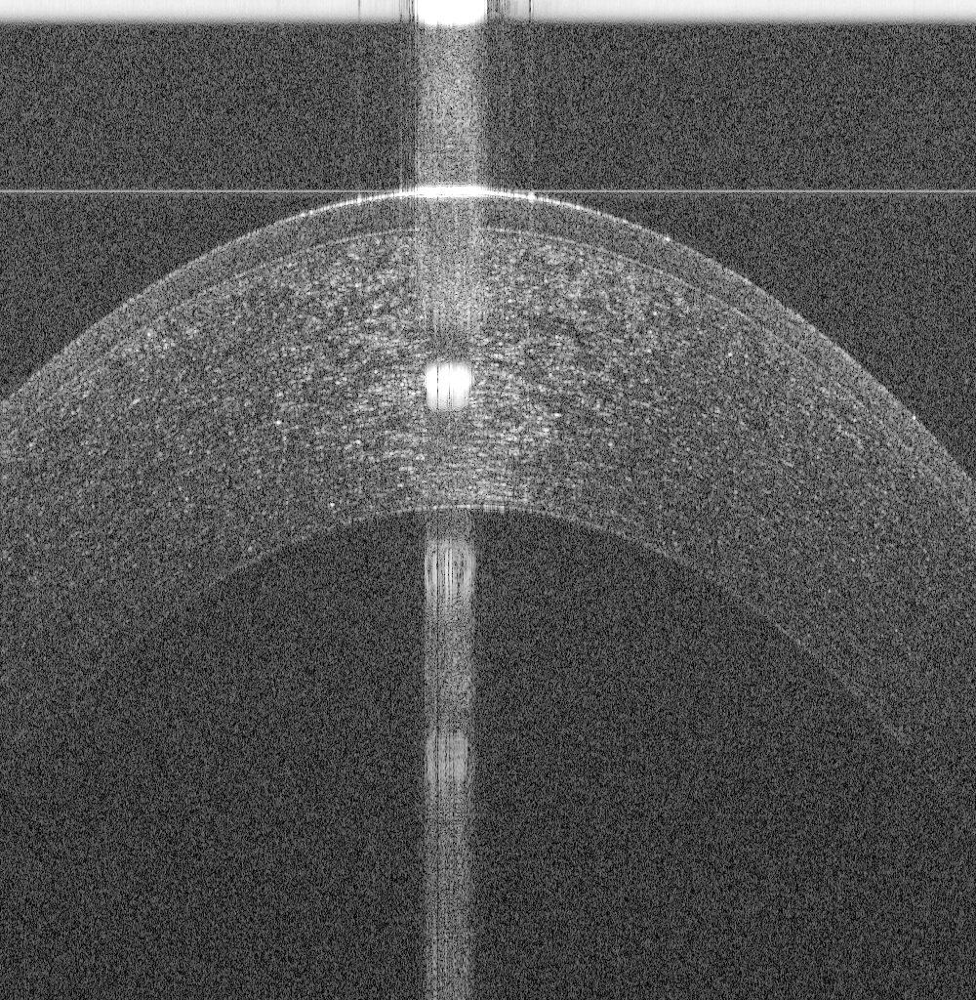
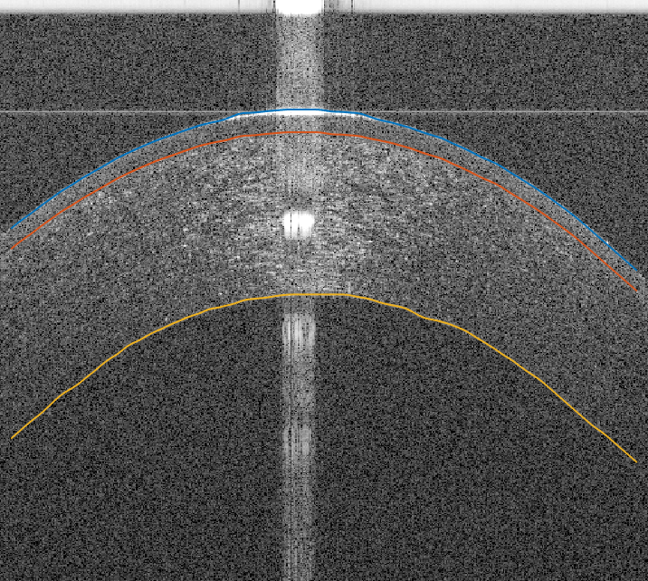

# README

This repository contains sample Matlab code for the segmentation of corneal layer interfaces using graph theory. A directed graph is constructed from the image and two auxiliary *start* and *end* nodes are added. The segmentation is formulated as finding the minimum-cost path between *stat* and *end* nodes. The proposed method is a generic method that segment normal and abnormal corneal optical coherence tomography (OCT) images, e.g., the OCT image shown in the following figure.

An example of the segmentation of three corneal layer interfaces in the OCT image is shown in the following figure.

I provided a starter project that segments three interfaces, but other interfaces can be segmented in the same way. The algorithm behind this code is published in the following paper:

[Pathological-Corneas Layer Segmentation and Thickness Measurement in OCT Images](https://tvst.arvojournals.org/article.aspx?articleid=2770939)

The paper is open access, so you can read the paper for more details.

Please, cite the paper if you used the code by using the following citation:

Amr Elsawy, Giovanni Gregori, Taher Eleiwa, Mohamed Abdel-Mottaleb, Mohamed Abou Shousha; Pathological-Corneas Layer Segmentation and Thickness Measurement in OCT Images. Trans. Vis. Sci. Tech. 2020;9(11):24. doi: https://doi.org/10.1167/tvst.9.11.24.

Note that the provided OCT image is obtained from me, Amr Elsawy, using Bioptegen OCT machine.